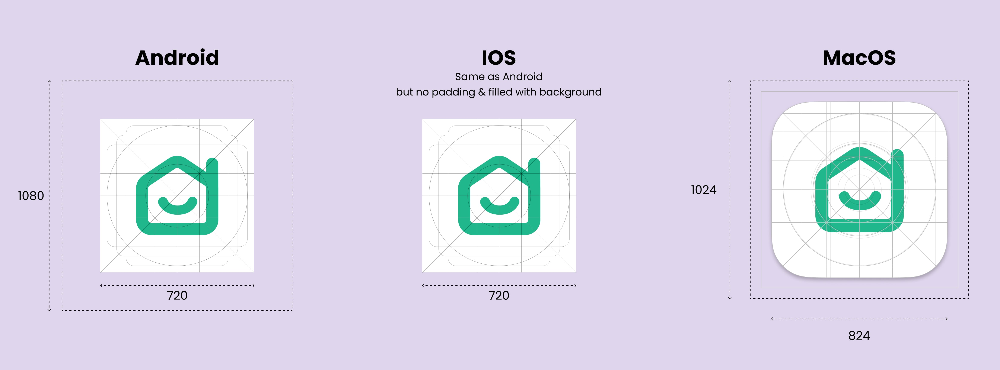

# Spooky Launcher Icons

Spooky uses [flutter_launcher_icons](https://pub.dev/packages/flutter_launcher_icons) to generate app icons for all flavors. This tool is highly customizable and supports adaptive icons.

## How it's implemented here?

1. **Prepare the Icons**  
   Design the required icons for each flavor based on the provided guidelines.

   **Guideline:**

   

2. **Add Dependency**  
   Add `flutter_launcher_icons` to `pubspec.yaml` file as a development dependency by running the following command:

   ```bash
   dart pub add flutter_launcher_icons --dev
   ```

3. **Generate Icons**  
   To generate the launcher icons, run:

   ```bash
   dart run flutter_launcher_icons
   ```

4. **Adjustments for Android**

   - We deleted the default icons from android/app/src/main/res, as they are unnecessary when using flavored builds.
   - Additionally, the generated ic_launcher.xml files included the `android:inset="16%"` attribute, which we removed since it wasn’t required.

5. **Adjustments for iOS**
   - Delete the default AppIcon.appiconset because each flavor already has its own icon set (e.g., AppIcon-spooky.appiconset, AppIcon-storypad.appiconset).
   - Open Xcode and update the ASSETCATALOG_COMPILER_APPICON_NAME setting for each flavor to use its respective icon set.
